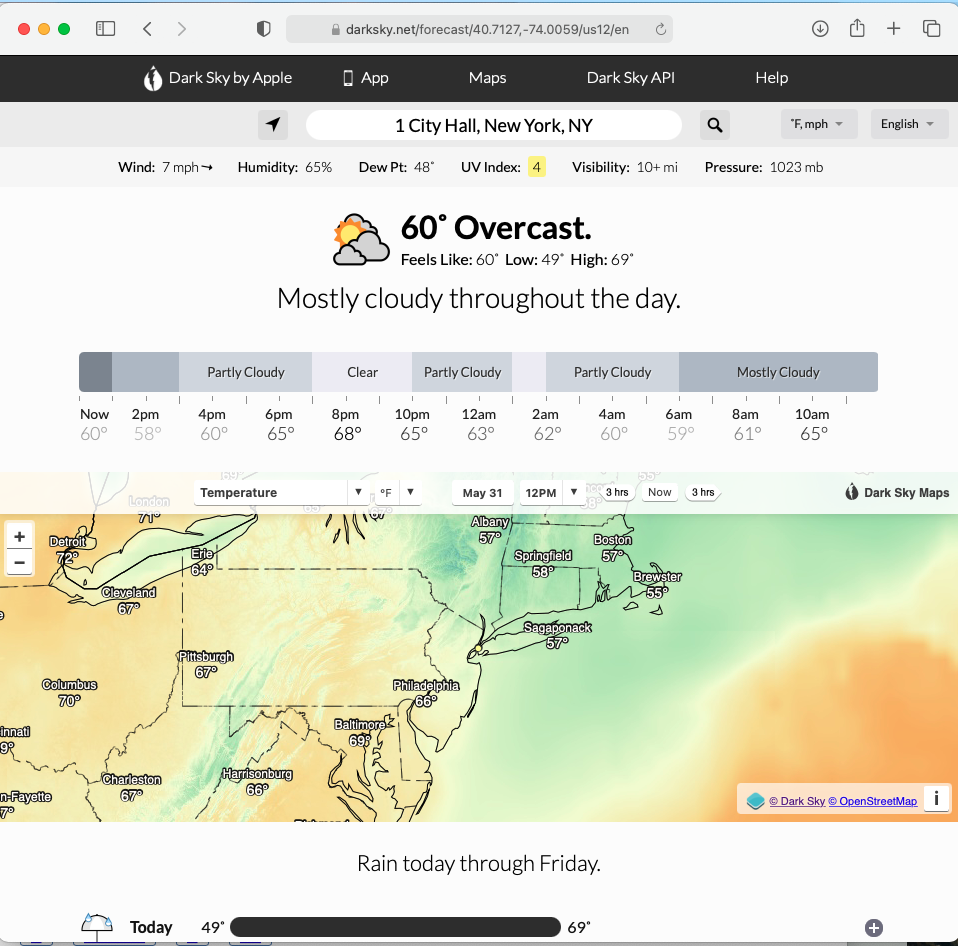

# Express Request

# Topics

- Environmental Variables
- Read URL parameters
- Common error: Two responses
- Common error: Place routes in correct order
- Multiple Parameters
- Request Object
- URL Queries

# Lesson

So far, we've been making simple `requests` and getting simple responses.

Let's look at weather site:

[Dark Sky](https://darksky.net/forecast/40.7127,-74.0059/us12/en)



What we notice is that the url is something like:

https://darksky.net/forecast/40.7127,-74.0059/us12/en

```
    http://darksky.net/forcast/40.7127,-74.0059/us1/en?units=metric&date=05312021

    \___/  \_________/  \___________________________/\_______________/
  protocol  host/domain          path                  query-string
```

How would we build this? Are there developers building a route for every single latitude and longitude? That would seem like a lot of developers would be working around the clock, and the code would not be very DRY.

Rather, we can use the URL to pass in values and design our web applications in a programmatic way.

To the users, the URL looks the same.

But for our server code, we would write the route as something like:

    http://darksky.net/forcast/:location/:timezone/:language?units=metric&date=05312021

In the request we would be able to get an object that looks like this that comes from the request parameters:

```js
{
  location: "0.7127,-74.0059",
  timezone: "us1",
  language: "en",
}
```

And we would also be able to get a second object that comes from the query-strings which would look like:

```js
{
  units: "metric",
  date: "05312021",
}
```

Which we could then use to find the data that we need in order to complete the response.
